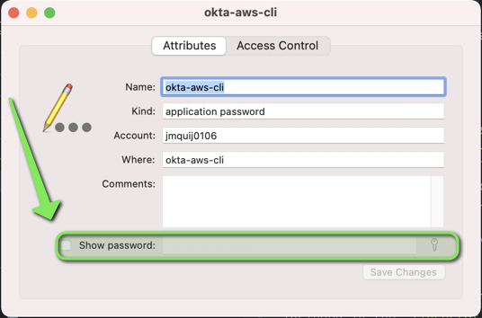
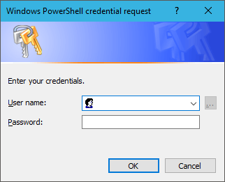

# OKTA_PASSWORD_CMD Documentation

## Help wanted!

Please contribute additional examples for your favored platform or password manager.

Notes:
- You need to set `OKTA_BROWSER_AUTH=false` in order for this to work.
- You need version 2.0.4 or greater of the `Okta AWS CLI Assume Role tool`.

## Example: macOS KeyChain

1. Create password entry `security add-generic-password -a $OKTA_USERNAME -s okta-aws-cli -T /usr/bin/security -U`
2. Launch `KeyChain Access` and search for **okta-aws-cli**, enter the password and save the changes.
   
3. Set OKTA_PASSWORD_CMD to `security find-generic-password -a $OKTA_USERNAME -s okta-aws-cli -w`

## Example: GNU/Linux [GNOME Keyring](https://wiki.gnome.org/Projects/GnomeKeyring)

1. Check if you have installed the `secret-tool` command. In Debian is included in the `libsecret-tools` package, so you can install it with `apt`:
   ```bash
   sudo apt install libsecret-tools
   ```
2. Create a new entry in your **Login Keyring** (you will be asked for your password):
   ```bash
   secret-tool store --label='Okta Credentials' okta:username $OKTA_USERNAME
   ```
3. Set `OKTA_PASSWORD_CMD` to:
   ```bash
   secret-tool lookup okta:username $OKTA_USERNAME
   ```

## Example: Windows PowerShell

1. Type the following into a PowerShell command
   ```pswh
   (Get-Credential).password | ConvertFrom-SecureString | Set-Content "$env:USERPROFILE\.okta\.password"
   ```
2. Type in your credentials into the resulting popup, PowerShell will encrypt your password using your user profile ([Windows Data Protection API](https://docs.microsoft.com/en-us/powershell/module/microsoft.powershell.security/convertfrom-securestring)) and store it in a file named `.password` in `$env:USERPROFILE\.okta\`  
   
4. Set `OKTA_USERNAME` if it is not already set
5. Set `OKTA_PASSWORD_CMD` to:
   ```property
   OKTA_PASSWORD_CMD=@echo off & for /f \"usebackq tokens=*\" %a in (`PowerShell -Command \"(New-Object System.Management.Automation.PSCredential ($env:UserName, (Get-Content $env:USERPROFILE\\.okta\\.password | ConvertTo-SecureString))).GetNetworkCredential().Password\"`) do echo %a
   ````

## Example: Plain text
1. Not recommended but if you're stuck/desperate it works
2. Add a `echo "XXXX"` to the `~/.okta/config.properties` file for your password
```bash
OKTA_PASSWORD_CMD=echo "mypassword"
```

## Example: Lastpass
1. Install LassPass' CLI tool, lpass
2. Store your password in LassPass, making note of the entries path in your hierarchy
3. Create an entry in `~/.okta/config`
```bash
OKTA_PASSWORD_CMD=lpass show --password mysite.com
```
